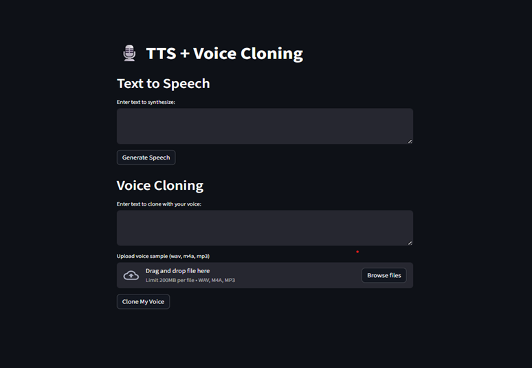

# 🎙️ Text-to-Speech & Voice Cloning System

This project demonstrates a complete **Text-to-Speech (TTS)** and **Voice Cloning** pipeline using **Coqui YourTTS**, **FastAPI**, and **Streamlit**.
It converts text into natural speech and clones voices from short audio samples.

## 🚀 Features

* ✅ Natural Text-to-Speech (multilingual, multi-speaker)
* ✅ Zero-shot Voice Cloning (clone a voice from just a few seconds of audio)
* ✅ REST APIs with **FastAPI**
* ✅ User-friendly frontend built with **Streamlit**
* ✅ One-click startup with `start_project.bat`


## 📂 Project Structure

```
text_speech_project/
│
├── app.py                # FastAPI backend
├── start_project.bat     # One-click startup
├── requirements.txt      # Dependencies
│
├── config/
│   └── settings.py
│
├── src/
│   ├── tts_engine.py     # TTS logic
│   ├── voice_cloning.py  # Voice cloning logic
│   ├── preprocessing.py  # Audio preprocessing (resampling, conversion)
│   └── utils.py
│
├── ui/
│   └── app_ui.py         # Streamlit frontend
│
├── data/
│   ├── output/           # Generated speech files
│   └── samples/          # User recordings
│
└── convert_m4a_to_wav.py # Utility for audio conversion
```


## ⚙️ Requirements

### Hardware

* CPU (works fine)
* GPU (CUDA 12.1) recommended for faster inference
* 8 GB RAM minimum (16 GB recommended)

### Software

* Python 3.10
* FFmpeg (added to PATH)
* Microsoft C++ Build Tools 14+ (Windows)

### Python Libraries

* `TTS==0.22.0`
* `torch`, `torchaudio`, `torchvision`
* `fastapi`, `uvicorn`, `streamlit`, `requests`
* `librosa`, `soundfile`, `pydub`
* `python-multipart`

---

## ▶️ How to Run

1. **Clone Repo**

   ```bash
   git clone https://github.com/Yuvraj235/text-to-speech-cloning.git
   cd text_speech_project
   ```

2. **Create Virtual Env**

   ```bash
   python -m venv venv310
   venv310\Scripts\activate
   ```

3. **Install Dependencies**

   ```bash
   pip install -r requirements.txt
   ```

4. **Run Project (One Click)**

   ```bash
   start_project.bat
   ```

5. **Access**

   * API: [http://127.0.0.1:8000/docs](http://127.0.0.1:8000/docs)
   * UI: [http://localhost:8501](http://localhost:8501)


## 🔗 API Endpoints

* **POST /tts/** → Convert text → speech
* **POST /clone/** → Convert text → cloned voice using uploaded sample


## 🏆 Results

* Generated natural-sounding `.wav` speech in multiple voices/languages.

### Voice Cloning Results

* Cloned user’s voice from a **5–10 sec sample**.
* Example: “This is my cloned voice.”

### Real-world Applications

* Accessibility for visually impaired users
* Personalized AI assistants
* Audiobook generation
* YouTube/Podcast content creation
* Healthcare (voice restoration)

---

## ⚠️ Challenges & Solutions

* **Python version issues** → Fixed by using Python 3.10
* **Torch installation mismatch** → Installed via official PyTorch wheel index
* **Voice sample (.m4a) issues** → Added preprocessing & FFmpeg support
* **Backend–Frontend errors** → Solved with `start_project.bat` automation

---

## 🔮 Future Improvements

* Custom training for more voices
* Deploying on cloud (Docker + API hosting)
* Packaging as desktop app (`.exe`)
* Mobile app frontend
* History of generated files in UI

---

### Streamlit UI

---

## ✅ Conclusion

This project demonstrates a **full-stack AI system** for **Text-to-Speech** and **Voice Cloning**, combining modern deep learning with practical engineering. With its modular design, APIs, and UI, it is suitable for **research, accessibility, and content creation**.


